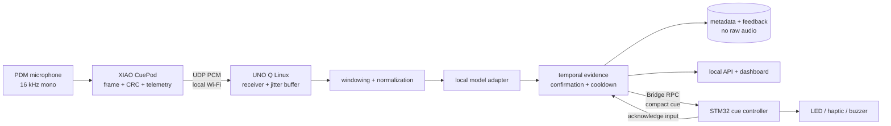

# System architecture

## Runtime view

## Responsibility split

| Component | Owns | Must not own by default |
|---|---|---|
| XIAO ESP32S3 Sense | PDM capture, framing, CRC, pod identity, local configuration, Wi-Fi reconnect, basic telemetry, test tone | Classification, raw-audio files, cloud upload |
| UNO Q Linux MPU | UDP receive, loss/jitter accounting, bounded audio buffer, preprocessing, model inference, temporal policy, metadata/feedback, API/dashboard | Unbounded raw audio, safety guarantees, precise actuator timing |
| UNO Q STM32 MCU | Buttons, acknowledgement, LED/haptic/buzzer patterns, health heartbeat/watchdog indication | Audio inference, history database, network configuration |
| Browser | Local presentation and user commands | Cloud analytics, raw-audio replay |

## Data lifecycle

1. The pod samples signed PCM and sends one 20 ms packet.
2. The receiver verifies magic/version/length/CRC, records arrival metadata, and orders frames in a bounded jitter buffer.
3. A missing frame becomes explicit zero fill plus a loss metric; it never blocks indefinitely.
4. Completed inference windows are converted to float32 in `[-1, 1]` and passed to the configured local model.
5. Broad model outputs map into the small CueLoop vocabulary.
6. The temporal engine updates state: `idle → observing → confirming → alerting → cooldown`, with class-specific evidence, hysteresis, and priority.
7. Only structured metadata is emitted and stored. The source samples are released once no active window needs them.
8. User feedback links to an event ID and policy context, never an audio blob.

## Failure behavior

- Bad magic/version/length/CRC: drop and count.
- Duplicate/late packet: drop and count.
- Gap: count missing sequence numbers, insert bounded silence, continue.
- Pod timeout: dashboard changes to disconnected; active unconfirmed evidence expires.
- Model failure: health becomes degraded; do not invent labels; physical cue switches to fault pattern only if configured.
- Bridge unavailable: Linux/dashboard remains operational and retries with a bounded backoff.
- Database unavailable: retain a bounded in-memory event list and flag degraded persistence.
- Process restart: reconstruct configuration and event metadata, never raw audio.

## Trust boundary

V1 UDP is designed for a trusted private LAN and provides corruption detection, not confidentiality or strong authentication. It must not be exposed to the public internet. Pairing uses an explicit locally configured receiver address and pod identifier. V2 should evaluate authenticated encryption after profiling and export review; V1 documentation makes the limitation prominent.

## Deployment shapes

- **Development computer:** same core pipeline, simulator sender, standard Python runtime, browser at localhost.
- **UNO Q standalone:** App Lab Python entry imports the core package, Bridge adapter is enabled, dashboard binds the declared local port, XIAO sends to the board's LAN address.
- **Fallback demo:** WAV replay or synthetic signatures, visibly labeled “SIMULATED INPUT”; never used as physical proof.
