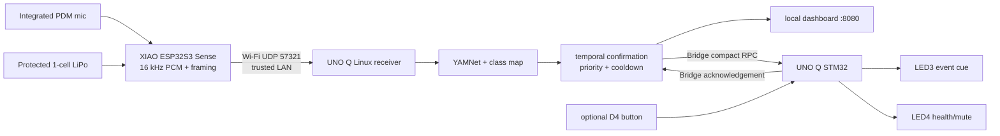
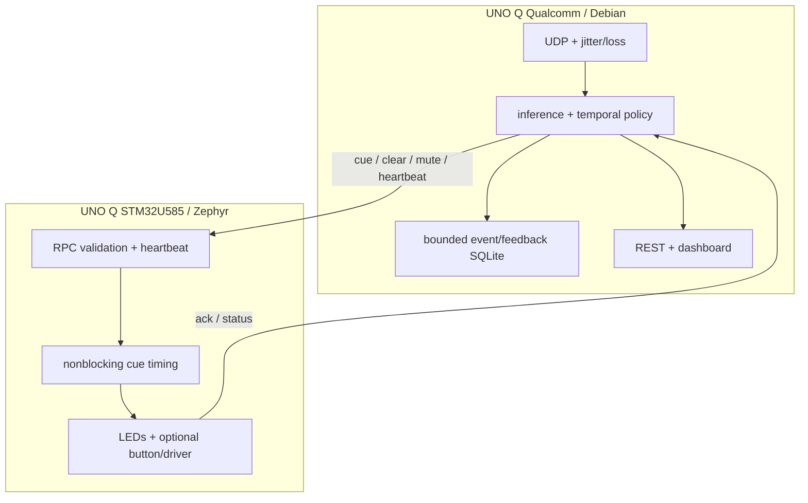
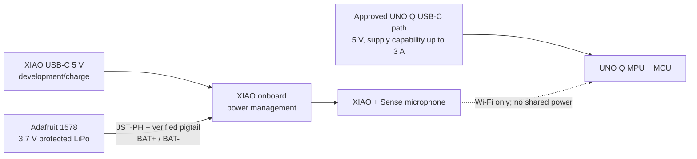
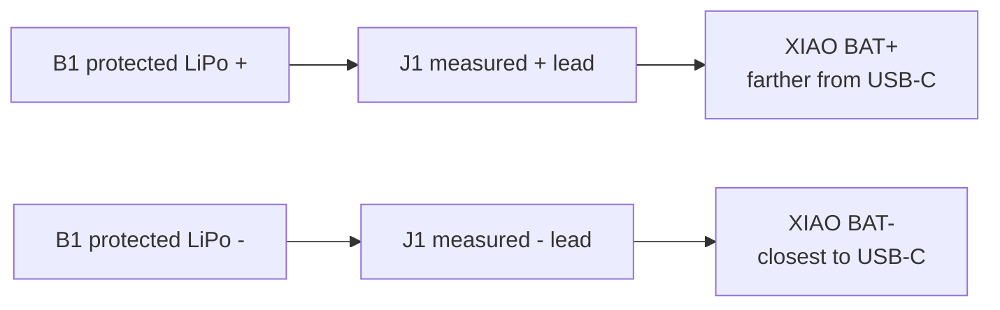

# System and protocol diagrams

## Wireless system block diagram



## Linux/MCU responsibility diagram



Linux owns uncertain/high-level work; the MCU owns bounded physical timing. If Bridge fails, inference/dashboard remain alive and report degradation. If the MCU restarts, a lower uptime status triggers mute/current-cue resynchronization.

## Power path diagram



## Battery connection diagram



The battery is detached while J1 is soldered. Connector orientation and voltage—not red/black insulation—determine polarity.

## Network protocol sequence

```mermaid
sequenceDiagram
  participant Pod as XIAO CuePod :57322
  participant Linux as UNO Q Linux :57321
  participant Model as Local model/policy
  participant MCU as UNO Q STM32
  participant UI as Browser :8080
  loop every 20 ms
    Pod->>Linux: 684-byte PCM v1 frame + CRC + sequence
  end
  Linux-->>Pod: 24-byte CRC ACK, at most once/s
  Linux->>Model: normalized bounded window
  Model-->>Linux: class scores + inference time
  Note over Linux: require temporal evidence; apply cooldown/mute
  Linux->>MCU: cueloop/cue(event, class, priority, permille)
  MCU-->>Linux: accepted boolean
  Linux-->>UI: event metadata/status JSON
  UI->>Linux: acknowledge / dismiss / mute
  Linux->>MCU: clear or mute
  MCU-->>Linux: button ack and periodic bounded status
```

CRC detects accidental corruption; it does not authenticate or encrypt. Do not deploy V1 on an untrusted network.
